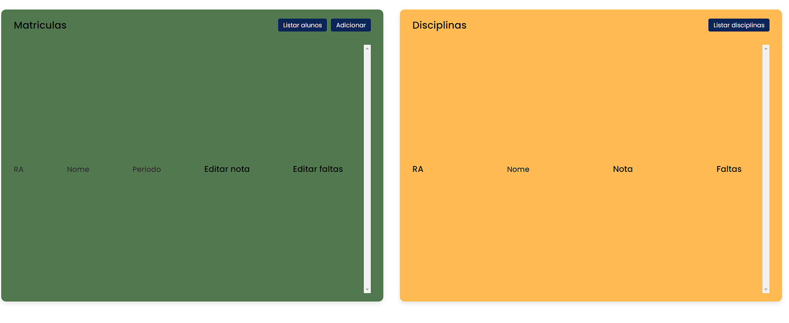
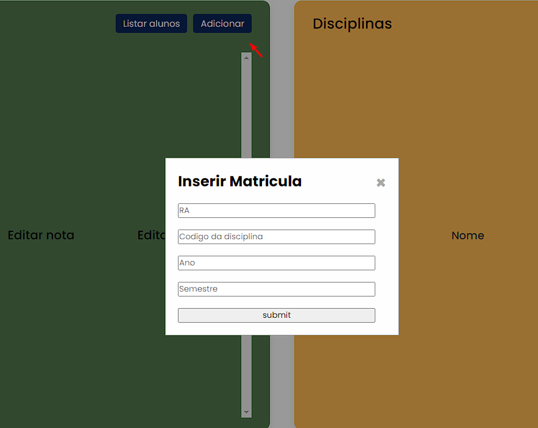
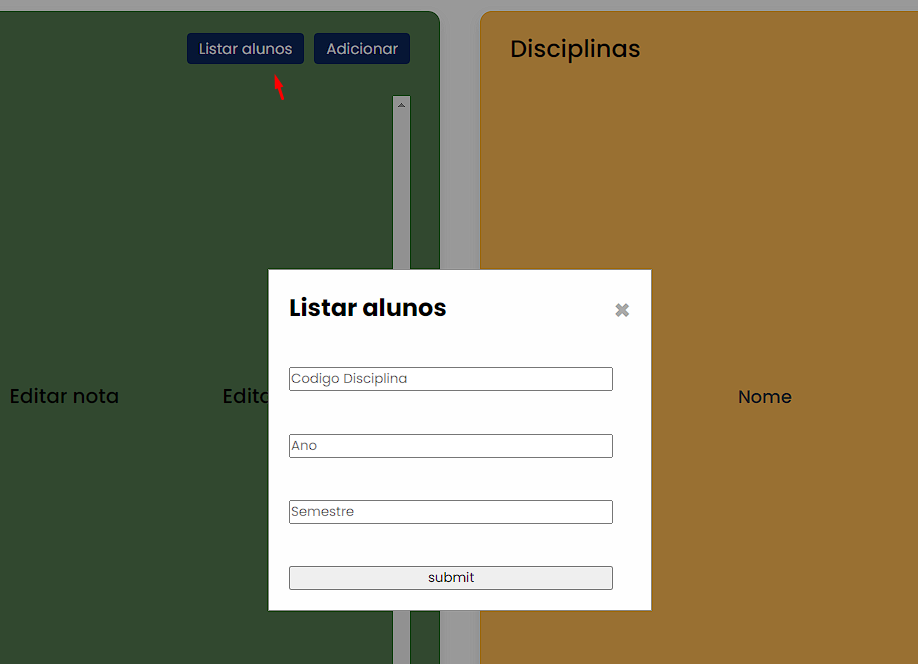
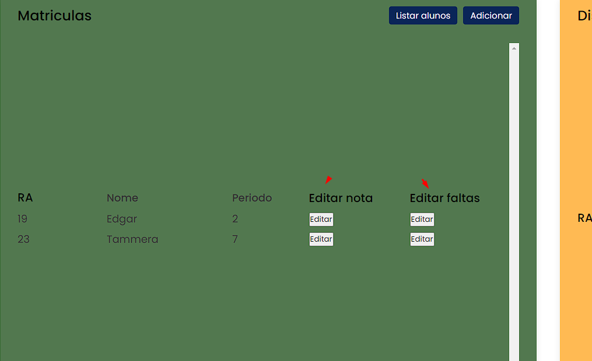
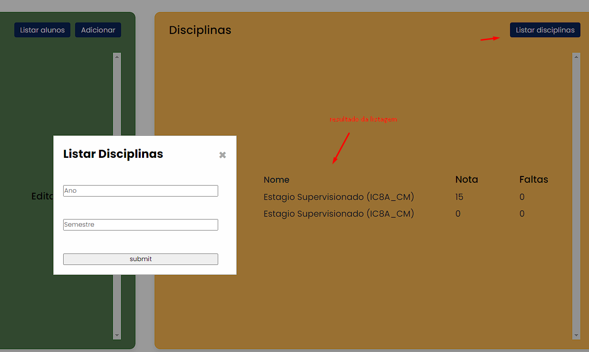

#  Dependencias
```
Apache/php, composer e python
Para o funcionamento, no nosso caso utilizamos o xampp.
```
# Como Compilar/Executar
```bash
python3 ./server.py ( necessário utilizar pip install protobuf)
Para o client, inicie o apache e acesse localhost/<pasta do projeto>/src/client.php (é necessário utilizar composer install antes)
```

# Bibliotecas usadas
```bash
- google/protobuf: client php - https://packagist.org/packages/google/protobuf
- protobuf (google.protobuf): server python  - https://pypi.org/project/protobuf/
```

# Exemplo de uso
```bash
python3 ./server.py
http://localhost/RED/src/client.php
```
 Apos aberto, a pagina abaixo será aberta.

 
##


## Inserção na tabela Matricula
 

## Listagem de alunos


## Alteração notas e faltas na tabela Matricula.
#### Após listado os alunos, é possível alterar as notas e faltas.


## Listagem disciplinas



