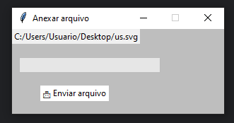
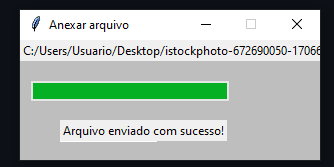

# Como Compilar/executar
```
python ./server.py
python ./client.py
```

# Bibliotecas usadas

```
- socket: implementação de sockets  https://docs.python.org/3/library/socket.html 
- os:  implementação de funcionalidades de  sistema operacional https://docs.python.org/3/library/os.html
- hashlib: implementação de hash https://docs.python.org/3/library/hashlib.html
- sys:  implementação de funcionalidades de sistema operacional;processos https://docs.python.org/3/library/sys.html
- logging: implementação sistema de log https://docs.python.org/3/library/logging.html
- math: implementação de funções matematicas (usado para retorno de inteiro na divisão) https://docs.python.org/3/library/math.html
- tkinter: implementação de interface gráfica https://docs.python.org/3/library/tkinter.html
```

# Exemplo de uso

```
python ./server.py
python ./client.py
```

### Após aberto, uma janela para inserir o arquivo será aberta.
<!-- inserir image -->


## Ao clicar em "Anexar arquivo", abrirá uma janela para selecionar o arquivo. Depois de selecionado será aberto outra janela para o envio do arquivo.



## Ao clicar em "Enviar arquivo", o arquivo será enviado para o servidor. 


## Após finalizado o envio, o arquivo pode ser encontrado no diretorio "./server"
